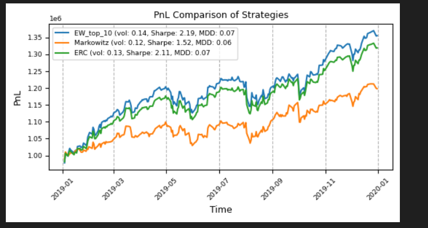

# Portfolio-Strategies

This repository contains the Python implementation of various portfolio optimization strategies including Equal Risk Contribution (ERC), Markowitz portfolio optimization, and the Equally Weighted strategy.

## Overview

Portfolio optimization is a fundamental technique in financial engineering and asset management. The goal is to allocate assets in such a way that maximizes returns for a given level of risk, or minimizes risk for a given level of expected return. This repository explores three main strategies:

- **Equal Risk Contribution (ERC)**: Aims to distribute risk equally across the assets in the portfolio.
- **Markowitz Portfolio Optimization**: Also known as Mean-Variance Optimization, it seeks to create a portfolio with the maximum returns for a given risk level.
- **Equally Weighted Strategy**: Allocates equal weights to all assets, ignoring risk and return profiles.

## Final Plot

This plot provides a visual comparison of the different portfolio strategies implemented in this repository.

